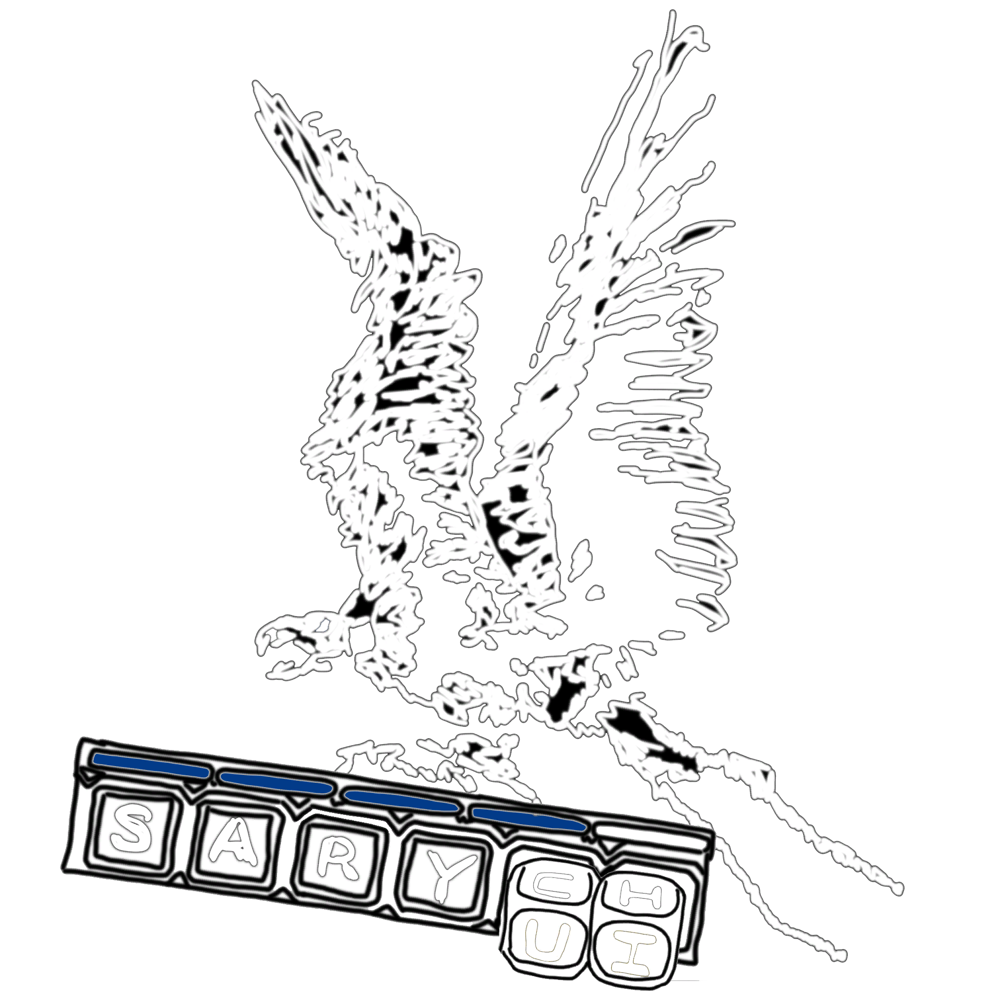

  

<h1 align="center">SarychUI</h1>

  Modular UI framework for World of Warcraft 3.3.5a 
  Модульный интерфейс для World of Warcraft 3.3.5a

  <a href="https://discord.gg/Thyh85WfmP"><strong>Discord</strong></a>
  &nbsp;•&nbsp;
  <a href="https://youtu.be/wvoK7YzF3b4"><strong>YouTube Guide / Видеогайд</strong></a>

---

### English

**SarychUI** is a modular UI framework for **World of Warcraft 3.3.5a**.

A complete setup and configuration guide is available on **YouTube**.

Additional **MPQ patches, client patches, DLLs, tools, and other modifications** can be found on the Discord server.

**Discord:** https://discord.gg/Thyh85WfmP
**YouTube Guide:** https://youtu.be/wvoK7YzF3b4

---

### Русский

**SarychUI** — модульный интерфейс для **World of Warcraft 3.3.5a**.

Полный гайд по установке и настройке доступен на **YouTube**.

Дополнительные **MPQ-патчи, патчи клиента, DLL, инструменты и другие модификации** можно найти на Discord-сервере.

**Discord:** https://discord.gg/Thyh85WfmP
**Видеогайд:** https://youtu.be/wvoK7YzF3b4
