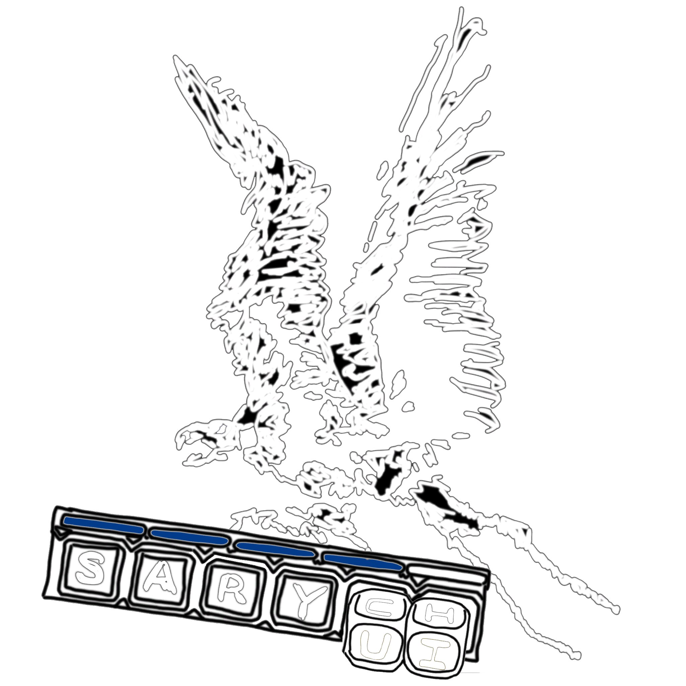

  

<h1 align="center">SarychUI</h1>

  Modular UI framework for World of Warcraft 3.3.5a 

  
  
  
  
  

---

### English

**SarychUI** is a modular UI framework for **World of Warcraft 3.3.5a**.

Guides, updates and previews are available on the **YouTube channel**.

Additional **MPQ patches, client patches, DLLs, tools and other modifications** can be found on the Discord server.

---

### Русский

**SarychUI** — модульный интерфейс для **World of Warcraft 3.3.5a**.

Гайды, обновления и демонстрации доступны на **YouTube-канале**.

Дополнительные **MPQ-патчи, патчи клиента, DLL, инструменты и другие модификации** можно найти на Discord-сервере.